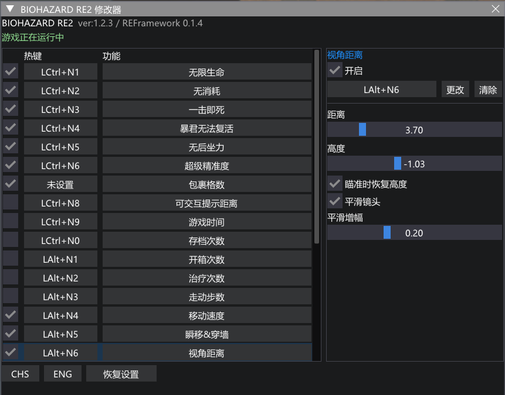
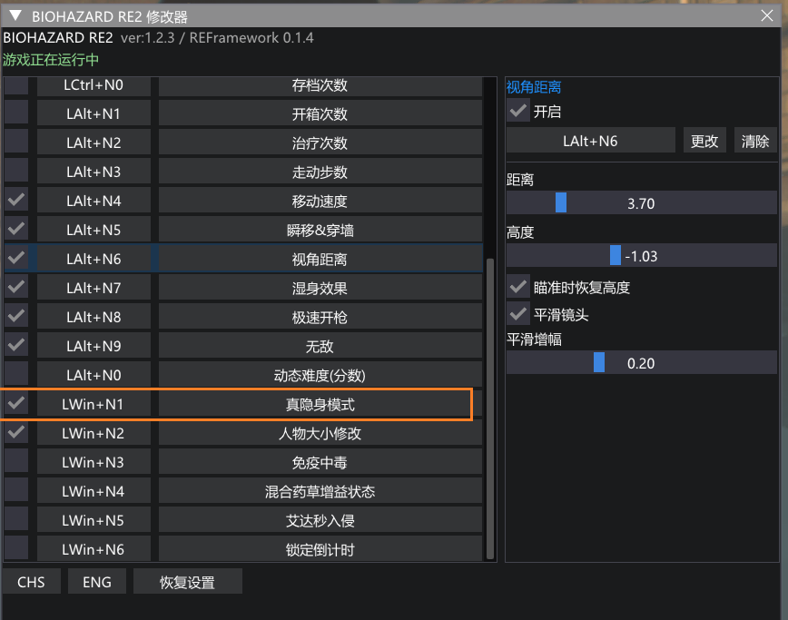

# RE2 Legacy Trainer

《生化危机 2 重制版》的 REFramework 修改器，按原 `Re2 Trainer.exe` 迁移 26 项游戏功能及其可见子选项。保留左侧功能列表、右侧选项、原默认快捷键，以及原版升降幅度。

**当前版本：0.1.5-beta。14 项经用户游戏内测试通过，12 项待测试。** “真隐身模式”标为待测试。具体清单见下方和 [验收记录](validation/gameplay_acceptance.json)。

本项目通过 **REFramework 执行 Lua 脚本**。完整安装还需要随包提供的 **原生辅助 DLL**，由 REFramework 的 PluginLoader 加载：可交互提示距离、移动速度、瞬移&穿墙、人物大小修改这四项依赖辅助 DLL。安装后不需要运行原 `Re2 Trainer.exe`。

- [下载安装包](https://github.com/LQB9/RE2LegacyTrainer/releases)
- [项目主页](https://github.com/LQB9/RE2LegacyTrainer)
- [问题反馈](https://github.com/LQB9/RE2LegacyTrainer/issues)

## 0.1.5 的改动

- 保存功能开关状态，下一次启动游戏或重载脚本时自动恢复；参数、语言、主功能及坐标按钮快捷键一并保留。
- 保存、读取、上升、下降的历史操作不会在重载后再次执行。保存点本身沿用原版的当前游戏会话范围。
- 滚动条加宽到 18 像素，并使用亮色滑块，方便找到列表后面的功能。
- 修改器字体放大到 26 像素，按钮及窗口尺寸同步放大。
- 界面底部显示 GitHub 项目地址，点击复制链接。
- “真隐身模式”选项标注“待测试”。

## 兼容范围

已核对的环境：Windows x64、Steam Build **11636119**、TDB **70**，REFramework 构建 **5bae470**，原生 API **1.10**。游戏 EXE SHA256：

```text
6CAAA815BF9E95F8A841BC81FDF29FEC55E836C87BAB8A76D55C69BEF9ADA941
```

安装脚本会校验这个游戏版本。本发布不修改游戏 EXE，也不分发原修改器、游戏程序或 Windows 字体。原生辅助 DLL 沿用实测的 0.1.4（状态接口版本 4）。

## REFramework 出处与安装

REFramework 是 **praydog** 发布的独立开源项目，本修改器依赖它运行。官方出处：

- [REFramework 源码与官方说明](https://github.com/praydog/REFramework)
- [官方稳定版下载](https://github.com/praydog/REFramework/releases)
- [官方安装说明](https://github.com/praydog/REFramework#installation)
- [Lua 与插件接口文档](https://cursey.github.io/reframework-book/)

1. **关闭游戏。** 在 Steam 库右键游戏 → 管理 → 浏览本地文件，找到包含 `re2.exe` 的文件夹。这是下面所有步骤使用的“游戏根目录”。默认安装路径可能不同，以实际找到的目录为准。
2. 打开官方稳定版下载页面，选择 RE2 对应的 **`RE2.zip`**。本项目核对的是 TDB 70 游戏版本，`RE2_TDB66.zip` 对应另一套旧版游戏接口。编写说明时官方稳定版为 [v1.5.9.1](https://github.com/praydog/REFramework/releases/tag/v1.5.9.1)，可[直接下载 RE2.zip](https://github.com/praydog/REFramework/releases/download/v1.5.9.1/RE2.zip)。本修改器实际游戏测试使用的框架构建为 `5bae470`；尚未逐项重测其他框架构建。
3. 按官方非 VR 安装说明，从压缩包中取出 **`dinput8.dll`**，放在游戏根目录中，与 **`re2.exe` 同级**。已有 REFramework 时可直接进入下一节；框架由官方项目维护，修改器 ZIP 不包含它。

## 安装本修改器

### 方式一：运行安装脚本

1. 从本项目 [Releases](https://github.com/LQB9/RE2LegacyTrainer/releases) 下载 `RE2LegacyTrainer-0.1.5-beta.zip`，解压到一个单独的文件夹；打开解压后包含 `Install.ps1` 的 `RE2LegacyTrainer` 文件夹。
2. 保持游戏关闭，在该文件夹打开 PowerShell，运行：

```powershell
.\Install.ps1 -GameDirectory 'D:\SteamLibrary\steamapps\common\RESIDENT EVIL 2  BIOHAZARD RE2'
```

把示例路径换成自己的游戏目录。脚本校验文件、备份同名旧插件并安装 Lua 和 DLL；已有的其他插件保留。

若 PowerShell 提示脚本执行被禁用，可在同一个文件夹执行以下单次命令，无需修改系统执行策略：

```powershell
powershell -NoProfile -ExecutionPolicy Bypass -File .\Install.ps1 -GameDirectory 'D:\SteamLibrary\steamapps\common\RESIDENT EVIL 2  BIOHAZARD RE2'
```

安装脚本只接受“兼容范围”中已核对的游戏 EXE；版本不同会停止安装，需要先重新确认兼容性。

### 方式二：手工复制

保持游戏关闭，从修改器 ZIP 中复制以下两个文件到游戏根目录下的对应子目录；没有文件夹就新建：

| 压缩包中的文件 | 放到游戏根目录下 |
|---|---|
| `reframework/autorun/re2_legacy_trainer.lua` | `reframework/autorun/re2_legacy_trainer.lua` |
| `reframework/plugins/re2_legacy_native.dll` | `reframework/plugins/re2_legacy_native.dll` |

中文界面还需要字体：安装脚本会从本机 Windows 复制微软雅黑。手工安装时，将本机 `C:\Windows\Fonts\msyh.ttc` 复制到游戏的 `reframework/fonts/`，重命名为 **`re2_legacy_font.ttc`**；没有该字体时可选择 ENG。字体不随仓库和 ZIP 分发。

完成后的目录示例（路径中的两个空格也应以自己的实际目录为准）：

```text
D:\SteamLibrary\steamapps\common\RESIDENT EVIL 2  BIOHAZARD RE2\
├── re2.exe
├── dinput8.dll                          ← 来自官方 REFramework 的 RE2.zip
└── reframework\
    ├── autorun\
    │   └── re2_legacy_trainer.lua       ← 本修改器 Lua 脚本
    ├── plugins\
    │   └── re2_legacy_native.dll        ← 本修改器辅助 DLL
    └── fonts\
        └── re2_legacy_font.ttc          ← 从本机 Windows 复制的字体
```

不要把 `dinput8.dll` 放进 `autorun` 或 `plugins`。不要把整个修改器源码目录当作插件文件夹复制；运行只需要上述 Lua、DLL 和字体。

### 启动、重载与卸载

启动游戏，按 **Insert** 打开 REFramework，展开 **ScriptRunner → Script Generated UI → RE2 Legacy Trainer / 原版修改器 (26)**，勾选“显示修改器面板”。读入存档后面板应显示“游戏正在运行中”。Lua 会从 `autorun` 自动加载，辅助 DLL 会从 `plugins` 自动加载。

从 0.1.4 更新时 DLL 没有变动；替换 Lua 后 Reset Scripts 即可。重载会恢复之前启用的功能；点击“恢复设置”会关闭所有功能并恢复默认参数和键位。

**Reset Scripts** 位于 REFramework 的 **ScriptRunner** 下，只用于重新加载 Lua。首次安装 DLL 或替换 DLL 后，需要关闭并重新启动游戏才能加载它。设置保存在游戏目录的 `reframework/data/re2_legacy_settings.json` 中，开关、参数、语言和快捷键会在下次启动恢复。

卸载本修改器时先关闭游戏，再移除 `re2_legacy_trainer.lua` 和 `re2_legacy_native.dll`。本修改器的字体及以 `re2_legacy_` 开头的配置文件可按需一并移除；其他 REFramework 插件使用的文件应保留。

## 使用

在左侧选择功能，在右侧修改参数或热键。把鼠标放在左侧列表内滚动，可查看全部 26 项。“极速开枪”是第 18 项，位于“湿身效果”和“无敌”之间。

默认快捷键区分左右修饰键，小键盘需要 NumLock 开启：

- 1–10：左 Ctrl + 小键盘 1–9、0。
- 11–20：左 Alt + 小键盘 1–9、0。
- 21–26：左 Win + 小键盘 1–6。

保存、读取、上升、下降默认未绑定，右侧各按钮下可设置组合键；Esc 取消设置，清除解除绑定。同一组合键重新分配时旧绑定会清除，按住不会重复触发。

穿墙采用正常移动并拦截重力、贴地和防穿透位置修正的设计。升降按原版每帧 0.1、持续 16 帧，单次名义距离 1.6；读取保存点后做短暂三轴稳定处理。没有角色控制器 warp 调用。

## 游戏内测试状态

测试来源为用户提供的 0.1.4 截图；勾选项通过，红框第 21 项按用户后续要求记为“待测试”，未勾选项也待测试。以下状态用于说明验收范围，自动检查不能替代待测试项的实际游戏效果。

| 状态 | 功能 |
|---|---|
| 通过（14） | 无限生命、无消耗、一击即死、暴君无法复活、无后坐力、超级精准度、包裹格数、移动速度、瞬移&穿墙、视角距离、湿身效果、极速开枪、无敌、人物大小修改 |
| 待测试（12） | 可交互提示距离、游戏时间、存档次数、开箱次数、治疗次数、走动步数、动态难度、真隐身模式、免疫中毒、混合药草增益、艾达秒入侵、锁定倒计时 |

截图展示的是 0.1.4 的测试界面；0.1.5 增加开关记忆、滚动条高亮、更大字体和项目链接。“真隐身模式”仍需验证敌人行为，当前版本没有新增该项修复。




## 功能与子选项

| 编号 | 功能 | 默认热键 | 原版子选项／参数 |
|---|---|---|---|
| 1 | 无限生命 | LCtrl+N1 | 敌人也一样，默认关闭 |
| 2 | 无消耗 | LCtrl+N2 | 保留数量增加 |
| 3 | 一击即死 | LCtrl+N3 | 排除当前玩家 |
| 4 | 暴君无法复活 | LCtrl+N4 | 开关 |
| 5 | 无后坐力 | LCtrl+N5 | 开关 |
| 6 | 超级精准度 | LCtrl+N6 | 原版内部值 100 |
| 7 | 包裹格数 | LCtrl+N7 | 8–20，默认 20 |
| 8 | 可交互提示距离 | LCtrl+N8 | 1–50，默认 15，步进 1 |
| 9 | 游戏时间 | LCtrl+N9 | 时／分／秒，默认 0 |
| 10 | 存档次数 | LCtrl+N0 | 自定义次数，存档后生效 |
| 11 | 开箱次数 | LAlt+N1 | 自定义次数，开箱后生效 |
| 12 | 治疗次数 | LAlt+N2 | 自定义次数，治疗后生效 |
| 13 | 走动步数 | LAlt+N3 | 自定义步数，走动时生效 |
| 14 | 移动速度 | LAlt+N4 | 0.5–5，默认 2，步进 0.1 |
| 15 | 瞬移&穿墙 | LAlt+N5 | 随意上升／下降；保存、读取、上升、下降及各自热键 |
| 16 | 视角距离 | LAlt+N6 | 距离 0–20，默认 1.3；高度 -5–5，默认 0；瞄准恢复、平滑镜头默认开启；增幅 0.05–0.5，默认 0.2 |
| 17 | 湿身效果 | LAlt+N7 | 湿度 0–1，默认 1，步进 0.1 |
| 18 | 极速开枪 | LAlt+N8 | 开关 |
| 19 | 无敌 | LAlt+N9 | 开关 |
| 20 | 动态难度(分数) | LAlt+N0 | 0–12999，默认 12999，步进 100 |
| 21 | 真隐身模式 | LWin+N1 | 开关 |
| 22 | 人物大小修改 | LWin+N2 | 0.1–5，默认 1；是否修改碰撞体积，默认关闭 |
| 23 | 免疫中毒 | LWin+N3 | 开关 |
| 24 | 混合药草增益状态 | LWin+N4 | 原版内部值 180 秒 |
| 25 | 艾达秒入侵 | LWin+N5 | 开关 |
| 26 | 锁定倒计时 | LWin+N6 | 开关 |

## 构建与检查

源码在 `src/`，Lua 和原生测试在 `tests/`。准备 Zig 0.13.0 与 Python 3，再执行：

```powershell
python -m pip install -r tests/requirements.txt
.\Build.ps1 -Zig 'C:\tools\zig\zig.exe' -Verify -Python 'python'
```

构建结果位于 `build/`。检查包含 25 组 Lua 行为与界面验证、6 组原生坐标动作验证及 6 项 DLL ABI 检查。原生测试运行于独立模拟进程，不向游戏注入测试对象。

发布包中包含文件校验清单 `manifest.json`。用户的设置、存档、内存转储、机器路径和原始 EXE 不包含在项目或发布包内。

## 依赖

[REFramework](https://github.com/praydog/REFramework) API 头文件遵循 MIT，许可证在 `licenses/REFramework-MIT.txt`；[MinHook](https://github.com/TsudaKageyu/minhook) 与 HDE 的许可证保留在 `src/minhook/LICENSE.txt`。接口参考：[REFramework 文档](https://cursey.github.io/reframework-book/)。
